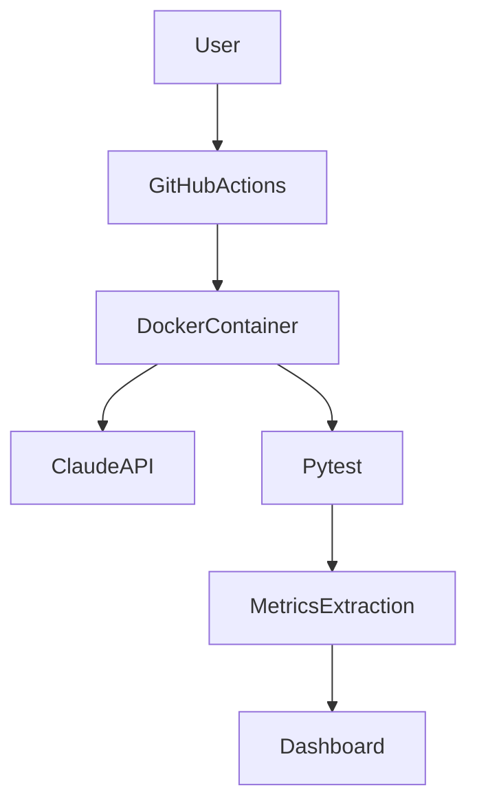

# 🚀 SWE-bench Pro Automated Evaluation Pipeline

An end-to-end **AI-powered software repair pipeline** built using **GitHub Actions**, Docker, and an AI coding agent (Claude).  
This project demonstrates a fully automated **Build → Verify → Measure** workflow.

---

## 🎯 Overview

This repository implements a SWE-bench Pro evaluation pipeline that:

✅ Sets up a Docker-based test environment  
✅ Runs failing tests  
✅ Uses an AI agent to generate fixes  
✅ Re-runs tests automatically  
✅ Extracts metrics  
✅ Generates a dashboard  

---

## 🧩 Workflow Architecture

```mermaid
flowchart LR
A[GitHub Actions Trigger] --> B[Environment Setup]
B --> C[OpenLibrary Testbed Init]
C --> D[Pre Verification Tests]
D --> E[Claude AI Agent Fix]
E --> F[Generate Patch Diff]
F --> G[Post Verification Tests]
G --> H[Extract Metrics]
H --> I[Generate Dashboard]
I --> J[Upload Artifacts]
```

This diagram shows the full automated evaluation pipeline.

---

## 🏗️ System Architecture

Technologies used:

- GitHub Actions
- Docker Container
- Claude AI Agent
- Pytest
- Python Automation Scripts

---

## ⚙️ Workflow Steps

1. Environment Setup  
2. Repository Initialization  
3. Pre-verification Test  
4. AI Agent Code Fix  
5. Patch Generation  
6. Post-verification Test  
7. Metrics Extraction  
8. Dashboard Generation  

---

## 🧠 AI Agent Used

**Agent:** Claude (Anthropic)

Why Claude?

- Strong code reasoning
- Structured outputs
- Reliable for automation pipelines

The AI agent reads `task.yaml`, modifies code, and logs prompts into `prompts.md`.

---

## 📊 Generated Artifacts

The workflow produces:

- agent.log
- result.json
- pre_verification.log
- post_verification.log
- changes.patch
- prompts.md
- dashboard.html

---

## ▶️ Running the Workflow

1. Go to **Actions** tab  
2. Select **SWE-bench Pro Evaluation**  
3. Click **Run Workflow**

---

## 🧪 Challenges Faced

- Missing infogami module in container  
- AI formatting causing syntax errors  
- SQLite query issues  
- Missing class methods

Each issue was solved through debugging and prompt refinement.

---

## 🎓 What I Learned

- CI/CD pipeline design
- AI-assisted debugging
- Containerized environments
- Automated software evaluation

---

## 🔗 Successful Workflow Run

(Add your workflow link here)

Example:

https://github.com/YOUR-USERNAME/YOUR-REPO/actions/runs/XXXXXXX

---

## 🏁 Conclusion

This project demonstrates an automated **AI-assisted Build-and-Verify pipeline**, enabling scalable software repair workflows.
